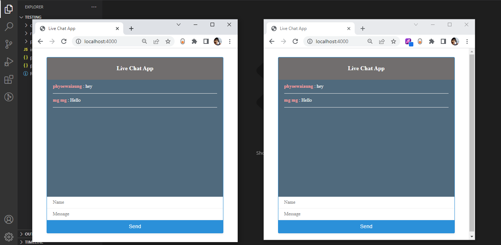

# web-socket-live-chat-app
 learing ***web-socket***<br> 
 ***socket.io***<br>
 This is my practise for WebSocket by using ***nodejs express server.***<br>

<p align="center">
</img>
</p>

..You can run this project by following the steps that I mentioned below.<br>
    1. Clone this project to your local machine.<br>
    2. you need to install nodejs to run this project.<br>
    3. Ater complete cloning and install nodejs on your local machine, you just need to run ```node index.js``` cmd in your cloned project folder.<br>
    
    
Kindly check this site and suggest me.
I would love to hear everything from you all.

Thanks for your time!


> Connect With Me on [LinkedIn](https://www.linkedin.com/in/phyoewaiaung082/)
